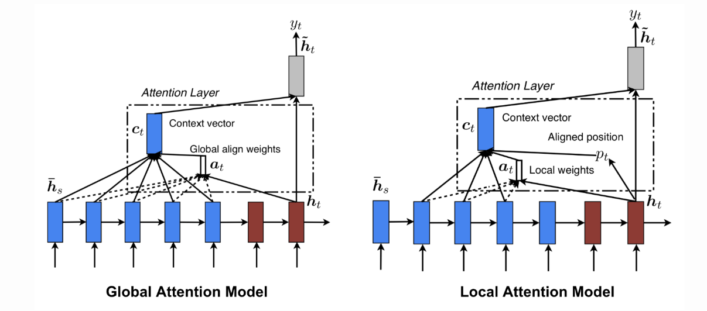
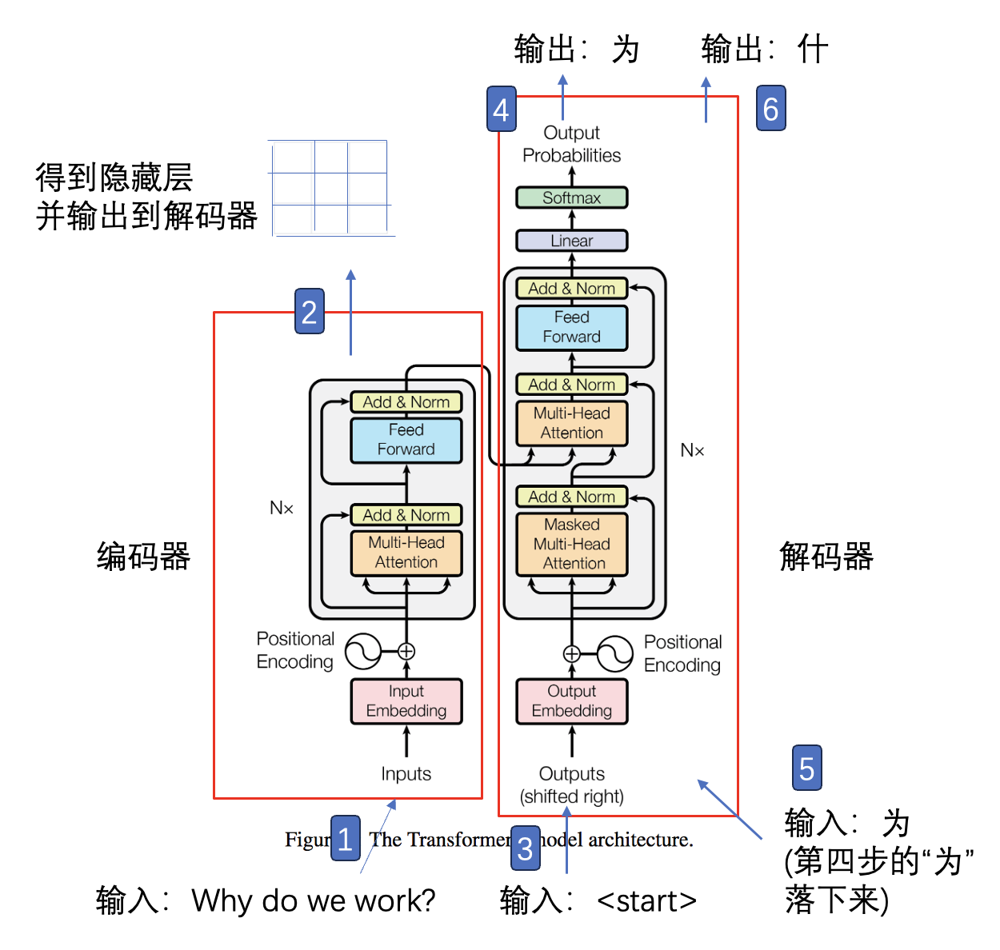
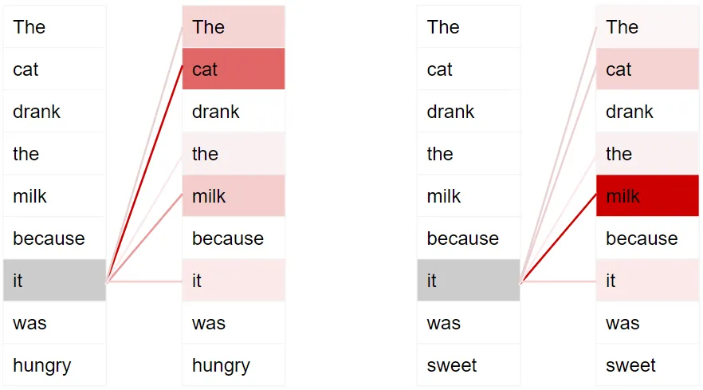
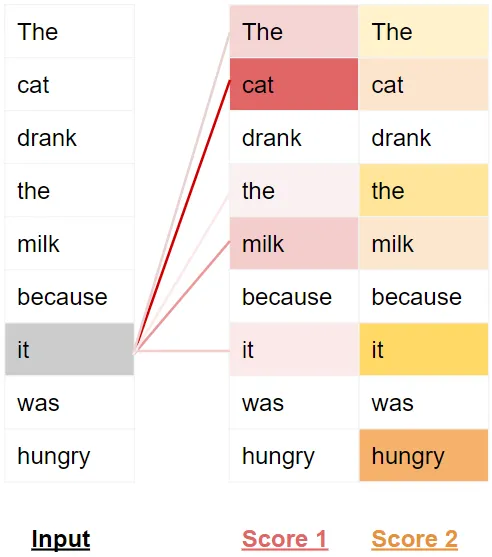
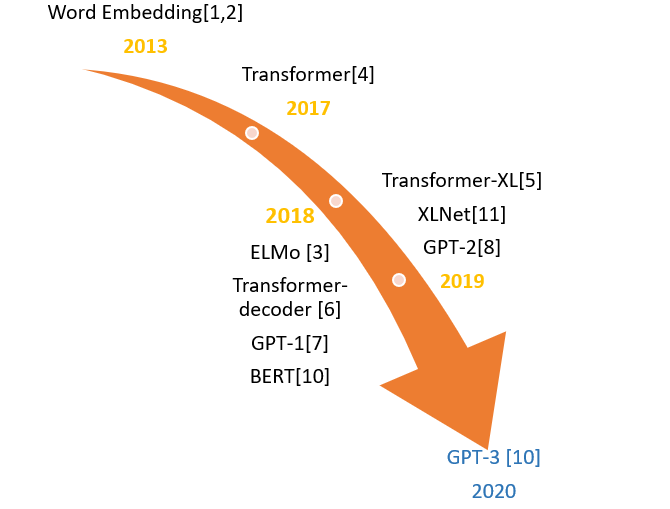
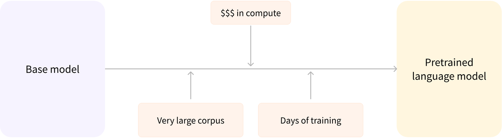
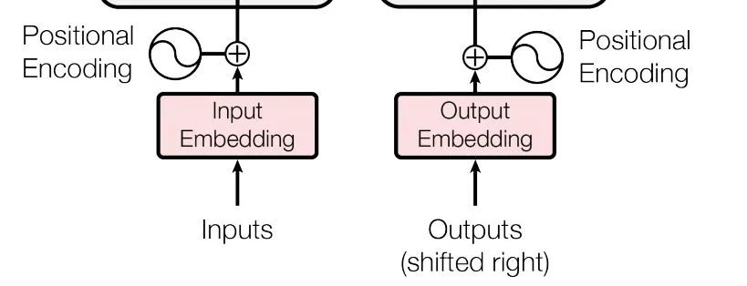
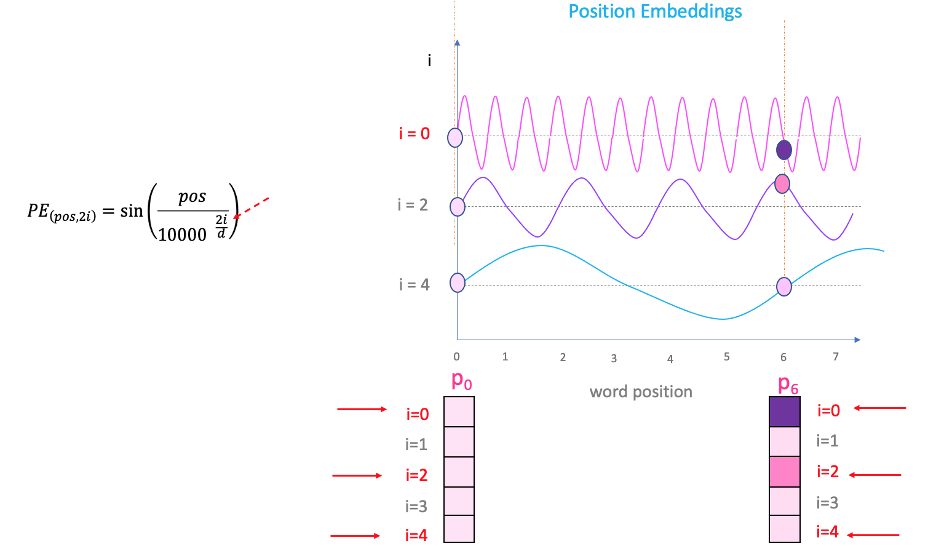
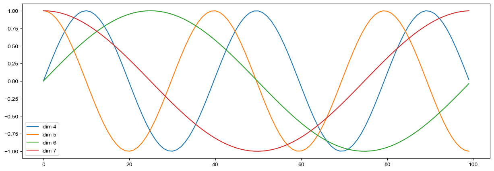

# 1. Attention 机制
## 1.1 深度学习中如何引入Attention 机制
注意力机制是自然语言处理（NLP）中基于Encoder - Decoder 的**神经机器翻译**(Neural Machine Translation )系统的一种改进。后来，这种机制被用于其他领域，包括计算机视觉、语音处理等。

在 2015 年Bahdanau 等人提出第一个 Attention 模型之前，神经机器翻译是**基于Encoder - Decoder 的 RNN / LSTM**的。编码器和解码器都是 LSTM/RNN 单元的堆叠。它的工作原理包括以下两个步骤：
1. **编码器 LSTM 用于处理整个输入句子并将其编码为上下文向量**，这是 LSTM/RNN 的最后一个隐藏状态。这应该是输入句子的一个很好的总结。编码器的所有中间状态都被忽略，最终状态 id 被认为是解码器的初始隐藏状态。
2. **解码器 LSTM 或 RNN 单元依次生成句子中的单词**。

简而言之，有两个 RNN/LSTM。一个我们称之为编码器——它会读取输入的句子并尝试理解它，然后再对其进行总结。它将总结（上下文向量）传递给解码器，解码器只需查看输入的句子即可对其进行翻译。

这种方法的主要缺点显而易见。如果编码器的总结不好，翻译也会不好。事实上，我们已经观察到，当编码器试图理解较长的句子时，它会创建一个糟糕的总结。这被称为 RNN/LSTM 的**长程依赖问题**。

由于梯度消失/爆炸问题，RNN 无法记住较长的句子和序列。它只能记住刚刚看到的部分。即使是提出编码器-解码器网络的Cho et al (2014)也证明了编码器-解码器网络的性能会随着输入句子长度的增加而迅速下降。

尽管 LSTM 被认为比 RNN 更能捕捉长程依赖关系，但它在特定情况下容易遗忘。另一个问题是，在翻译句子时，无法赋予某些输入词比其他词更重要的重要性。 

**那么，在创建上下文向量时，我们有没有办法保持输入句子中的所有相关信息完好无损？**
> Bahdanau 等人（2015）提出了一个简单但优雅的想法，他们建议不仅可以在上下文向量中考虑所有输入词，还可以赋予每个输入词相对的重要性。

因此，每当所提出的模型生成一个句子时，它都会在编码器隐藏状态中搜索一组可获得最相关信息的位置。这个想法被称为“**注意力**”。
    
## 1.2 Attention 机制如何起作用？
Attention 机制的核心就是“**加权求和**”。它们的工作原理如下：
1. **分解输入**：假设您有一堆单词（或任何类型的数据）想要计算机理解。首先，计算机会将这些输入分解成更小的部分，例如单个单词。
2. **挑选出重要的部分**：然后，它会查看这些部分并决定哪些是最重要的。它会通过将每个部分与它心中的问题或“查询”进行比较来实现这一点。
3. **分配重要性**：根据每个部分与问题的匹配程度，为其分配一个分数。分数越高，该部分就越重要。
4. **集中注意力**：对每个部分进行评分后，系统会确定对每个部分应给予多少关注。得分较高的部分会获得更多关注，而得分较低的部分则会获得较少关注。
5. **加权求和**：最后，计算机将所有信息加起来，但会给重要的信息赋予更大的权重。这样，计算机就能更清楚地了解输入中最重要的信息。

> 从上面的建模，我们可以大致感受到 Attention 的思路简单，四个字“带权求和”就可以高度概括，大道至简。做个不太恰当的类比，人类学习一门新语言基本经历四个阶段：死记硬背（通过阅读背诵学习语法练习语感）->提纲挈领（简单对话靠听懂句子中的关键词汇准确理解核心意思）->融会贯通（复杂对话懂得上下文指代、语言背后的联系，具备了举一反三的学习能力）->登峰造极（沉浸地大量练习）。
这也如同attention的发展脉络，RNN 时代是死记硬背的时期，attention 的模型学会了提纲挈领，进化到 transformer，融汇贯通，具备优秀的表达学习能力，再到 GPT、BERT，通过多任务大规模学习积累实战经验，战斗力爆棚。
要回答为什么 attention 这么优秀？是因为它让模型开窍了，懂得了提纲挈领，学会了融会贯通。
— — 阿里技术
    
## 1.3 全局注意力与局部注意力
“全局”注意力这个术语意味着所有输入都很重要。最初，全局注意力（由 Luong 等人于 2015 年定义）与我们之前讨论的注意力概念有一些细微的差别。

区别在于，它考虑编码器 LSTM 和解码器 LSTM 的所有隐藏状态来计算“可变长度上下文向量 ” 。

**当应用“全局”注意力层时，会产生大量计算。这是因为必须考虑所有隐藏状态，将它们连接成一个矩阵，并与正确维度的权重矩阵相乘，才能得到前馈连接的最后一层。**

因此，随着输入大小的增加，矩阵大小也会增加。简而言之，前馈连接中的节点数量增加，实际上增加了计算量。

        
    我们可以采取任何方式减少这种情况吗？当然可以！答案就是局部注意力。
当我们尝试从任何给定的信息中推断某些事情时，我们的大脑倾向于通过仅采用最相关的输入来智能地进一步缩小搜索空间。

全局和局部注意力的思想受到了主要用于计算机视觉任务的软注意力和硬注意力概念的启发。

**软注意力是全局注意力，其中所有图像块都被赋予一定的权重；但在硬注意力中，一次只考虑一个图像块。**

但局部注意力与图像字幕任务中使用的硬注意力不同。 相反，它是两种概念的混合，在上下文向量生成中，它不考虑所有编码输入，而是只考虑一部分。这不仅避免了软注意力中产生的昂贵计算，而且比硬注意力更容易训练。

**实现局部注意力：**
1. 预测对齐位置：模型需要预测在源句子中哪个位置
    $(p_t)$
   对于当前的目标词嵌入最为重要。
2. 定义注意力窗口：在预测的位置
   $p_t$
   周围定义一个大小为 2D 的窗口，其中 D 是经验选择的一个参数。
3. 计算上下文向量：上下文向量是窗口内输入序列的加权平均值。权重是根据预测的位置和窗口内的每个位置之间的相似度来计算的。

此外，对齐方式可以有两种：
1. 单调对齐，其中
   $p_t$
   设置为 t，假设在时间 t  时，只有 t  附近的信息才重要
2. 预测对齐，其中模型本身预测对齐位置如下：
   $p_t=S\cdot\mathrm{sigmoid}(v_p^\top\tanh(W_ph_t))$
其中，
$V_p$
和
$W_p$
是训练过程中学习到的模型参数，S 是源句子长度。

下图展示了全局和局部注意力机制之间的区别。全局注意力考虑所有隐藏状态（蓝色），而局部注意力仅考虑一个子集：
    

    
# 2. Transformer概述
## 2.1 Transformer模型

**编码器-解码器架构**

Transformer的核心是其编码器-解码器架构——两个关键组件之间的共生关系，分别负责处理输入序列和生成输出序列。编码器和解码器中的每一层都包含相同的子层，包括自注意力机制和前馈网络。这种架构不仅有助于全面理解输入序列，而且能够生成上下文丰富的输出序列。

**位置编码**

尽管Transformer模型具有强大的功能，但它缺乏对元素顺序的内在理解。通过将输入嵌入与位置信息结合起来，位置编码使模型能够区分序列中元素的相对位置。这种细致的理解对于捕捉语言的时间动态和促进准确理解至关重要。

**多头注意力**

Transformer模型的一个显著特征是它能够同时关注输入序列的不同部分——这是通过多头注意力实现的。通过将查询、键和值向量分成多个头，并进行独立的自注意力计算，模型获得了对输入序列的细致透视，能够带有多样化的上下文信息。

**前馈网络**

与人类大脑能够并行处理信息的能力类似，Transformer模型中的每一层都包含一个前馈网络——一种能够捕捉序列中元素之间复杂关系的多功能组件。通过使用线性变换和非线性激活函数，前馈网络使模型能够在语言的复杂语义景观中航行，促进文本的理解和生成。

    
如上图，transformer模型本质上是一个Encoder-Decoder的结构。输入序列(inputs)先进行Embedding，经过Encoder之后结合上一次output再输入Decoder，最后用softmax计算序列下一个word的概率。

## 2.2 Transformer 工作流程
用两个句子来演示具体工作流程：
- The cat drank the milk because it was hungry。
- The cat drank the milk because it was sweet。

在第一句中，“it”指的是“猫”，而在第二句中，它指的是“牛奶”。当模型处理单词“it”时，self-attention 会给模型提供更多关于其含义的信息，以便它能够将“it”与正确的单词联系起来。
    

为了使它能够处理更多关于句子的意图和语义的细微差别，Transformer为每个单词提供了**多个注意力分数**。

例如，在处理单词“it”时，第一个分数突出了“cat”，而第二个分数突出了“hungry”。因此，当它解码单词“it”时，通过将其翻译成另一种语言，它会将“cat”和“hungry”的某些方面结合到翻译的单词中。
    

## 2.3 小故事讲解
Transformer模型具体是如何工作的，为方便理解，先看个简单的案例感受一下流程。

例：假设你要组织一次聚会，需要准备食物、饮料和娱乐活动。你可以将这个过程类比为一个Transformer模型的工作方式:

1. **策划阶段（编码器 - Encoder）：**
  - 收集信息：你首先询问朋友们他们喜欢的食物、饮料和娱乐活动，这就像Transformer模型的编码器在**接收输入信息**。
  - 记录喜好：你将每个人的喜好记录下来，比如小明喜欢披萨，小红喜欢果汁，小刚喜欢玩桌游。这些记录就像Transformer模型中的“**编码**”过程，将原始信息转换成内部表示。
2. **统筹安排（自注意力机制 - Self-Attention）：**
  - 考虑关联性：在准备聚会时，你注意到小明和小红都是素食者，所以你会准备水果披萨和蔬菜拼盘。这个考虑关联性的过程就像Transformer模型中的自注意力机制，它能够注意到**不同信息之间的关联性**。
  - 优先级排序：你发现大多数人都喜欢披萨，所以你决定披萨应该是主要食物。这个决定过程就像自注意力机制中的**权重分配**，重要的信息会被赋予更高的权重。
3. **执行阶段（解码器 - Decoder）：**
  - 按计划准备：根据记录的喜好和考虑到的关联性，你开始准备食物、饮料和娱乐活动。这就像Transformer模型的解码器，它**根据编码器的输出和自注意力机制的结果来生成最终的输出**。
  - 调整细节：在准备过程中，你可能会根据实际情况调整计划，比如发现某人不喜欢某种饮料，你会换成另一种。这就像解码器在生成输出时会**根据上下文调整细节**。
4. **聚会进行时：**
  - 享受成果：最终，聚会顺利进行，朋友们享受着他们喜欢的食物、饮料和娱乐活动。这就像Transformer模型成功完成了翻译任务或其他序列到序列的任务。
    
**通过这个例子，我们可以看到Transformer模型的工作流程：**
- 编码器（策划阶段）接收并处理输入信息（朋友的喜好）。
- 自注意力机制（统筹安排）识别信息之间的关联性并分配权重（考虑素食者和大多数人的喜好）。
- 解码器（执行阶段）根据编码器的输出和自注意力机制的结果生成最终的输出（准备聚会所需的物品）。
- 这样，Transformer模型就像一个高效的聚会组织者，能够根据不同的需求和关联性来完成任务。
    
## 2.4 Transformer 的发展历程

2013年----word Embedding

2017年----Transformer

2018年----ELMo、Transformer-decoder、GPT-1、BERT

2019年----Transformer-XL、XLNet、GPT-2

2020年----GPT-3

  

    
## 2.5 Transformer的提出对seq2seq模型的影响：
1. 摒弃了RNN结构

Transformer模型完全摒弃了传统的RNN结构，转而使用自注意力（self-attention）机制来处理序列数据。这使得模型能够并行处理序列中的所有元素，大大提高了计算效率。
2. 引入自注意力机制

自注意力机制允许模型在处理每个序列元素时考虑到序列中所有其他元素的信息，通过计算序列中所有元素之间的关联权重，为每个元素生成一个加权表示，从而有效地建模全局依赖关系，而不是像RNN那样仅依赖于之前的信息。通过引入自注意力机制有助于捕捉长距离依赖关系。
3. 位置编码

由于Transformer不包含递归结构，因此它本身无法捕捉序列元素的位置信息。为了解决这个问题，Transformer引入了位置编码（positional encoding），位置编码为序列中的每个元素提供了一个位置向量，该向量与元素的嵌入向量相加，以保留序列的顺序信息，将位置信息与元素的特征表示相融合。
4. 编码器-解码器架构的改进

Transformer采用堆叠的编码器和解码器层，每层包含自注意力子层和前馈网络子层，实现了深层网络的构建。这种架构提高了模型的表达能力。
5. 训练效率的提升

由于Transformer通过自注意力机制的并行化处理，显著提高了训练过程中的计算效率，降低了时间复杂度，它在训练时比基于RNN的seq2seq模型更加高效，可以处理更长的序列，同时训练时间也大大缩短。
6. 在NLP领域的广泛应用

Transformer的提出极大地推动了自然语言处理（NLP）领域的发展，尤其是它在机器翻译、文本摘要、问答系统等任务中的应用，取得了显著的性能提升。
7. **促进了预训练模型的发展**

Transformer的成功为BERT（Bidirectional Encoder Representations from Transformers）等预训练模型的出现奠定了基础，这些模型进一步推动了NLP技术的边界。
    
## 2.6 迁移学习
预训练是一种从头开始训练模型的方式：所有的模型权重都被随机初始化，然后在没有任何先验知识的情况下开始训练。这个过程不仅需要海量的训练数据，而且时间和经济成本都非常高。
    

    
因此，大部分情况下，我们都不会从头训练模型，而是将别人预训练好的模型权重通过迁移学习应用到自己的模型中，即使用自己的任务语料对模型进行“二次训练”，通过微调参数使模型适用于新任务。
    

    
1. 预训练模型的兴起

Transformer模型的自注意力机制和深度堆叠架构为预训练模型提供了一个强大的基础。这种架构能够捕捉复杂的语言特征和长距离依赖关系，使得模型在预训练阶段能够从大量**未标注文本**中学习丰富的语言表示。
2. 语言表示的学习

在预训练阶段，Transformer模型通过两种主要任务来学习语言表示：**掩码语言模型（Masked Language Model, MLM）和下一句预测（Next Sentence Prediction, NSP）**。MLM任务通过随机掩码输入序列中的某些词，训练模型预测这些词；NSP任务则训练模型判断两个句子是否在原始文本中是连续的。这些任务帮助模型学习到了深层的语言规律和语义信息。
3. 迁移学习的推动

Transformer模型在预训练后，可以在多种下游任务中进行**微调（fine-tuning）**，而无需从头开始训练。这种迁移学习的方式大大减少了特定任务所需的数据量和训练时间，使得模型能够在资源有限的场景下也能取得良好的性能。
4. 模型规模的扩大

Transformer模型的并行计算能力使得扩大模型规模成为可能。随着模型参数量的增加，模型的表示能力也得到提升。例如，BERT、GPT系列等模型都是在Transformer的基础上通过**增加层数和宽度**来扩大模型规模，从而在多项NLP任务上取得突破。
5. 多语言和多模态的扩展

Transformer模型的结构也易于扩展到多语言和多模态任务。例如，多语言版的BERT（mBERT）和XLM等模型通过在多种语言上预训练，能够处理跨语言的NLP任务。而多模态的Transformer模型，如ViT（Vision Transformer）和CLIP（Contrastive Language-Image Pre-training），则能够处理图像和文本的结合任务。

总之，Transformer的提出对seq2seq模型产生了革命性的影响，它不仅在模型结构上带来了创新，而且在实际应用中取得了显著的成功。不仅如此，Transformer模型的提出和成功应用为预训练模型的发展提供了坚实的基础，它在语言表示学习、迁移学习、模型规模扩大、多语言和多模态扩展、社区资源积累以及性能提升等方面都产生了深远的影响。预训练模型已成为NLP领域的一个重要研究方向，并且在实际应用中展现出巨大的潜力。 
    
# 3. Transformer vs CNN vs RNN
假设输入序列长度为n，每个元素的**维度为 d**，输出序列**长度也为 n**，每个元素的**维度也是 d**。
可以从每层的计算复杂度、并行的操作数量、学习距离长度三个方面比较 Transformer、CNN、RNN 三个特征提取器。

**Q、K、V知识引入**

在Self-Attention中，每个输入元素（比如一个词）都被映射为三个向量：Query（Q）、Key（K）和Value（V）

- Query（查询）：假设你想买一台笔记本电脑，你的需求如电脑的性能（比如需要高性能的处理器用于游戏或者专业软件）、价格范围、品牌偏好等就是 Query。你带着这些需求去寻找合适的电脑。

- Key（键）：每台笔记本电脑的产品参数和特点介绍就是 Key。例如，某台电脑的产品介绍里提到它有英特尔酷睿 i7 处理器、16GB 内存、高分辨率屏幕等，这些就是 Key，就像一个个标签等待你的需求（Query）来对照。

- Value（值）：这台电脑实际能给你带来的体验就是 Value。包括它的实际性能表现、外观设计、售后服务等。当你看中一台电脑的产品参数（Key）符合你的需求（Query）后，你就会关注它的实际价值（Value），比如它的实际游戏运行流畅度或者专业软件的使用体验等。

对于输入序列中的每个Query向量 $Q_i$，我们需要将其与所有Key向量 $Key_j$ 进行点乘操作，整个序列中共有  n 个Key向量。每次点乘操作的计算复杂度为 $O(d)$，因为 $Q_i$ 和 $Key_j$ 都是  d 维的向量。因此，对于单个Query向量 $Q_i$，计算所有点乘操作的总复杂度为 $O(n*d)$ 。由于序列中包含  n  个Query向量，每个向量都需要执行这样的操作，所以整个Self-Attention机制的总计算复杂度是
$O(n^2 * d)$  

## 3.1 计算复杂度
Self-Attention：考虑到 n 个 key 和 n 个 query 两两点乘，每层计算复杂度为 $O(n^2*d)$  

RNN：考虑到矩阵(维度为n∗n)和输入向量相乘，每层计算复杂度为 $O(n*d^2)$

CNN：对于k个卷积核经过n次一维卷积，每层计算复杂度为 
    $O(k \times n \times d^2) $
深度可分离卷积：每层计算复杂度为为
     $O(k \cdot n \cdot d + n \cdot d^2) $
    
因此：
当 $n\leq d\text{}$ 时，self attention 要比 RNN 和 CNN 快，这也是大多数常见满足的条件。

当 $n>d$ 时，可以使用受限 self attention，即：计算 attention时仅考虑每个输出位置附近窗口的 r 个输入。这带来两个效果：
- 每层计算复杂度降为为
      $O(r \times n \times d) $
    
- 最长学习距离降低为 r，因此需要执行为  $O\left(\frac{n}{r}\right) $次才能覆盖到所有输入。
    
## 3.2 并行操作数量
可以通过必须串行的操作数量来描述
- 对于 self-attention，CNN，其串行操作数量为 $O(1)$，并行度最大。
- 对于 RNN，其串行操作数量为 $O(n)$，较难并行化。
    
## 3.3 最长计算路径
覆盖所有输入的操作的数量
- 对于self-attention，最长计算路径为 $O(1)$；对于 self-attention stricted，最长计算路径为 $O(n/r)$。
- 对于常规卷积，则需要 $O(n/k)$ 个卷积才能覆盖所有的输入；对于空洞卷积，则需要 $O(log_kn)$ 才能覆盖所有的输入。
- 对于 RNN，最长计算路径为 $O(n)$

作为额外收益，self-attention 可以产生可解释性的模型：通过检查模型中的注意力分布，可以展示与句子语法和语义结构相关的信息。
    
# 4. 输入嵌入(Input Embedding)
**位置编码**(**Position Embedding**)是Transformer模型中用来引入序列中词语位置信息的一种机制，因为Transformer本身不包含循环和卷积结构，无法直接捕捉序列顺序。位置编码通常是对每个词的嵌入向量进行加和，以保持模型对序列顺序的敏感性。

位置编码(Position Embedding)通常不是模型参数的一部分，而是一种固定的或者可学习的嵌入向量，它们在模型训练过程中不会通过反向传播进行更新。

Encoder 的输入包含**词向量**(**Word Embedding **)和**位置向量**(**Position Embedding**)，词向量和正常的网络一样，通过学习获得，维度为 $d_{model}$。
## 4.1 词嵌入（Word Embedding）
在PyTorch中，**nn.Embedding层**用于实现词嵌入（Word Embedding），它本质上是一个**查找表**（**Lookup Table**），可以根据输入的索引（通常是单词的序号）来检索对应的嵌入向量。

以下是关于nn.Embedding层权重矩阵的两种常见选择：

（1）使用**预训练(Pre-trained) 的Embeddings**并固化
  - 在这种情况下，权重矩阵是从预训练的词嵌入模型中加载的，比如Word2Vec、GloVe或FastText等。
  - 在加载这些预训练的嵌入向量后，通常会将这些权重设置为不可训练（即不需要梯度），这样在训练过程中这些嵌入向量保持不变。
  - 这种方法的**优点**是可以利用预训练嵌入中包含的丰富语义信息，尤其是在训练数据不足的情况下，这有助于提高模型的性能。

     
（2）对其进行**随机初始化(当然也可以选择预训练的结果)并设为可训练的**(**Trainable**)。这样在训练过程中不断地对 Embeddings 进行改进。 
  - 在这种情况下，权重矩阵是随机初始化的，通常使用均匀分布或高斯分布进行初始化。
  - 这些嵌入向量在训练过程中是可训练的，意味着它们会随着模型的训练而更新。
  - 这种方法的优点是嵌入向量可以根据特定任务进行调整，可能捕捉到预训练嵌入中未包含的特定领域信息。
      
> "**Trainable"与"Freeze"（冻结）相对**：

> 当一个参数被标记为"Trainable"时，意味着它将参与训练过程，即它的值会随着训练的进行而改变。相反，如果一个参数被"Freeze"（冻结），则其值在训练过程中保持不变，即使计算出了梯度也不会更新这个参数。
    
## 4.2 位置编码(Position Embedding)

    
**为什么要使用位置编码？**

在RNN中，对句子的处理是一个个 word **按顺序输入的**。但在 Transformer 中，输入句子的所有word是**同时处理**的，没有考虑词的排序和位置信息。因此，Transformer 的作者提出了加入 “positional encoding” 的方法来解决这个问题。“positional encoding“”使得 Transformer 可以衡量 word 位置有关的信息。

### 4.2.1 具有位置信息的编码实现
以往的位置向量是通过学习获得的，Google在论文中提到，他们比较过直接训练出来的位置向量和下面公式计算出来的位置向量，两者效果是接近的。我们这里选用公式构造的Position Embedding了，**优点**是不需要训练参数，而且即使在训练集中没有出现过的句子长度上也能用。

Positional Encoding的公式如下：
  $$\mathrm{PE}_{(pos,2i)}=\sin\left(\frac{pos}{10000^{2i/d_{\mathrm{model}}}}\right)$$                

$$\mathrm{PE}_{(pos,2i+1)}=\cos\left(\frac{pos}{10000^{2i/d_{\mathrm{model}}}}\right)$$
    

    
这里的意思是将 pos 的位置映射为一个 d_model 维的位置向量，这个向量的第 i 个元素的数值就是 ${PE}_{(pos,i)}$。

其中，2i 指的是 embedding 词向量的偶数维度，2i+1 指的是embedding 词向量的奇数维度。

虽然“d_model”是固定的，但“pos”和“i”会变化。让我们试着理解后两者：
由于“sin”曲线以间隔重复，在下图中可以看到，尽管 $P_0$ 和 $P_6$ 处于两个截然不同的位置，但它们具有相同的位置嵌入值。这就是等式中的“i”部分发挥作用的地方。
    

    
如果改变上述等式中的“i”，将得到一系列具有不同频率的曲线。通过读取不同频率的位置嵌入值，最终会为  $P_0$和 $P_6$ 在不同嵌入维度上提供不同的值。
    
### 4.2.2 为什么选用公式构造的Position Embedding
Position Embedding本身是一个**绝对位置**的信息，但在语言中，**相对位置**也很重要。
Google选择上述的位置向量公式的一个重要原因是：由于我们有$$\sin(\alpha+\beta)=\sin\alpha\cos\beta+\cos\alpha\sin\beta $$ 以及 $$\cos(\alpha+\beta)=\cos\alpha\cos\beta-\sin\alpha\sin\beta $$，这表明位置p+k 的向量可以表示成位置 p 的向量的**线性变换**，这种机制便于模型捕捉序列中不同位置的元素之间的相对位置关系。

### 4.2.3 相对位置信息
相对位置:  周期性变化规律
    

    
可以看到某个序列中不同位置的单词，在某一维度上的位置编码数值不一样，即同一序列的不同单词在单个纬度符合某个正弦或者余弦，可认为他们的具有相对关系。

总结来说，Positional Encoding 公式通过结合周期性、位置差异、维度特定编码和平滑变化，为序列中的每个单词提供了一个独特的编码，这反映了单词的相对位置信息，并允许 Transformer 模型在处理序列数据时考虑到这些位置信息。
    
# 5. 参考链接
1、《Attention Is All You Need》https://arxiv.org/abs/1706.03762

2、An annotated implementation of the Transformer paper：https://github.com/harvardnlp/annotated-transformer/tree/master

3、https://transformers.run/c1/transformer/

4、Transformer: PyTorch Implementation of "Attention Is All You Need"：https://github.com/hyunwoongko/transformer

5、多头注意力代码实现: https://www.cnblogs.com/xiximayou/p/13978859.html

6、Notes about "Attention is all you need"：https://github.com/hkproj/transformer-from-scratch-notes

7、Position Embedding 的实现：https://www.cnblogs.com/wevolf/p/15188846.html

8、External-Attention-pytorch：https://github.com/xmu-xiaoma666/External-Attention-pytorch

9、Transformer输入输出细节以及代码实现https://blog.csdn.net/wl1780852311/article/details/121033915
